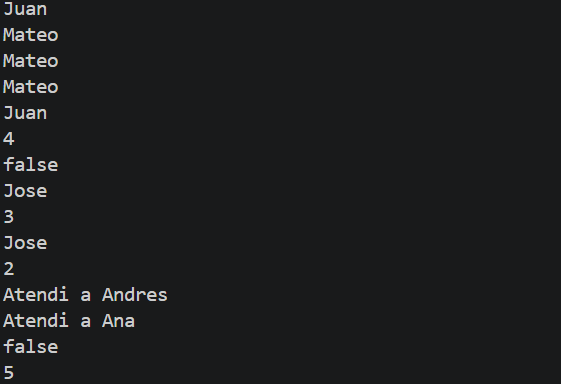
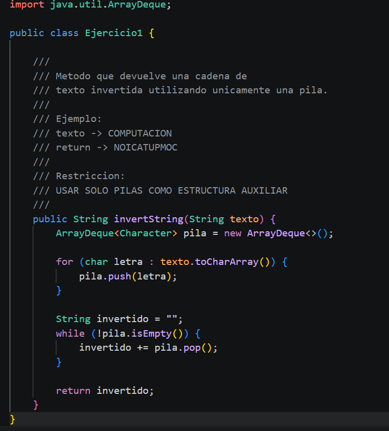
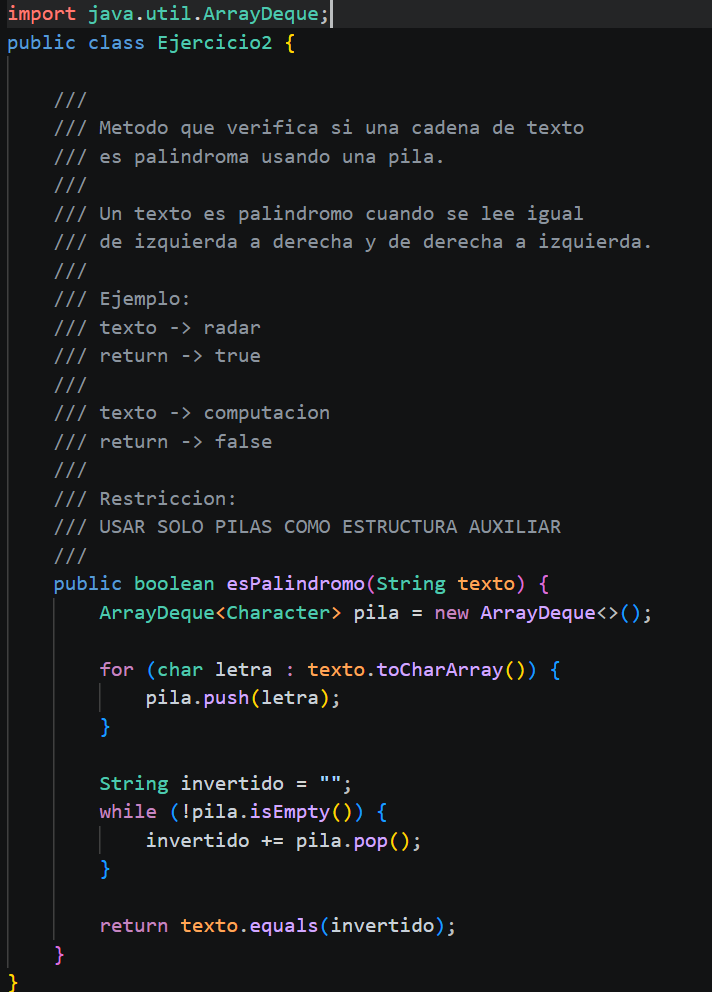

# Practica: Estructuras Dinamicas Lineales

## Datos del Estudiante
- **Nombre:** Evelyn Mayancela
- **Curso:** Computacion P68
- **Fecha:** 10/06/2025

---

## 1. Implementacion de estructuras dinamicas lineales

**Fecha:** 10/06/2025

**Descripcion:**

Se implementaron ejemplos de uso de estructuras dinamicas lineales en Java:
LinkedList para manejo de listas enlazadas, Queue y ArrayDeque como cola (FIFO),
y ArrayDeque como pila (LIFO). Cada estructura fue probada con operaciones
basicas de insercion, consulta y extraccion de elementos.

### Captura de salida en consola



### Captura del codigo de implementacion del ejercicio 1



---

## 2. Ejercicio Palindromo

**Fecha:** 10/06/2025

**Descripcion:**

Se implemento el metodo `esPalindromo` en la clase `Ejercicio2.java`.
El metodo recibe una cadena de texto, almacena cada caracter en una pila,
extrae los caracteres para formar el texto invertido y lo compara con el
original. Si son iguales, la palabra es palindroma.

### Metodo implementado

```java

```